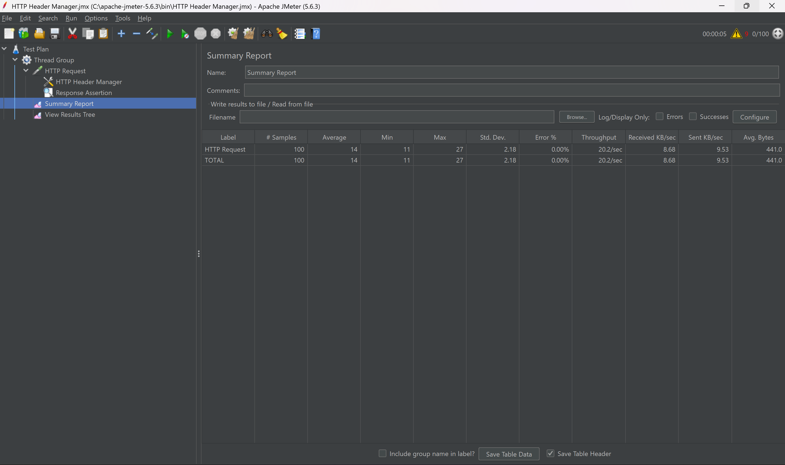
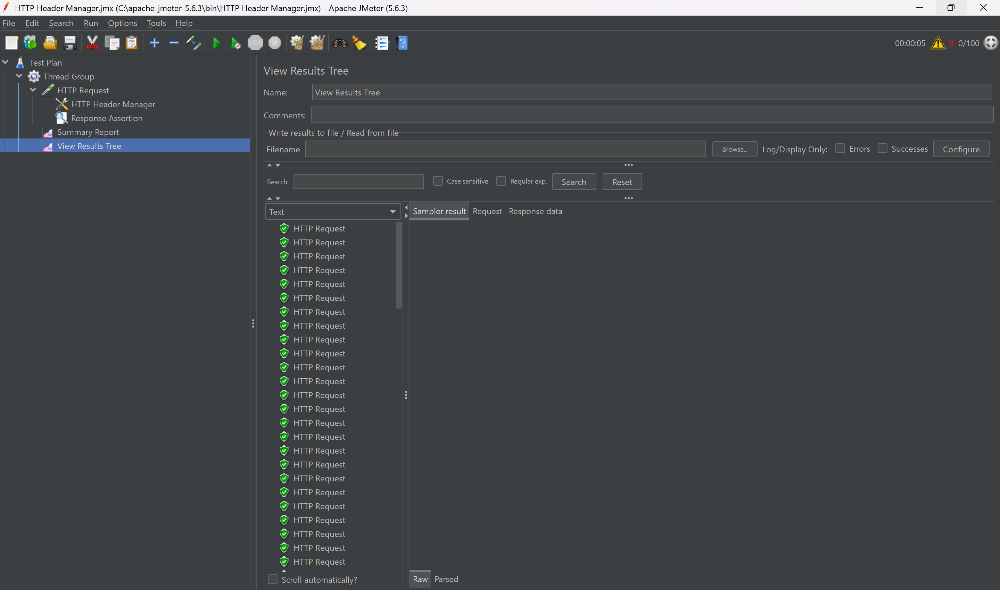

# 🚀 Core Payment Ledger & Wallet System

A highly secure, concurrent digital wallet system built to handle high-frequency financial transactions with absolute data integrity. This system treats every transfer as a double-entry accounting ledger to prevent anomalies like "Double-Spend".

---

## 🌟 Key Features

- ✅ **Atomic Operations:** Ensures debit and credit happen as one unit via `@Transactional`.
- ✅ **Concurrency Control:** Prevents race conditions using `PESSIMISTIC_WRITE` locks.
- ✅ **Idempotency:** Redis-backed keys prevent duplicate transactions during network retries.
- ✅ **Immutable Ledger:** Every money movement is recorded chronologically.
- ✅ **Secure:** JWT-based authentication and authorization.

---

## 🛠 Tech Stack

| Component | Technology |
| :--- | :--- |
| **Backend** | Java 17, Spring Boot 3.x |
| **Database** | PostgreSQL |
| **Caching/Locks** | Redis |
| **Frontend** | React.js |
| **Security** | JWT (JSON Web Token) |

---

## 🧪 Testing Methodology

1. **Concurrency Testing (JMeter):** Simulated 100 concurrent requests; achieved zero data corruption and total balance integrity.
2. **API Validation (Postman):** Verified REST endpoints, Register, Login, and Transfer flows.
3. **Unit & Integration Testing (JUnit & Mockito):** Isolated `TransferService` logic to validate balance constraints.

---

## ⚙️ How to Run

1. **Database:** Ensure PostgreSQL is running and update `application.properties`.
2. **Redis:** Start your Redis server for idempotency checks.
3. **Backend:** Run `mvn clean install` and start the Spring Boot application.
4. **Frontend:** Navigate to the frontend folder and run `npm install` followed by `npm start`.

---

## 📁 Project Structure

| File/Layer | Purpose |
| :--- | :--- |
| `@Service` | Business logic and transfer calculations |
| `@Repository` | Database interaction and JPA execution |
| `@RestController` | HTTP request handling and JSON responses |

---

## 🖼️ Performance Proof

---

## 🤝 Contribute

Feel free to fork this repository and suggest improvements, such as adding transaction history filters or advanced reporting features.

---

# Wallet Transaction System
Built with precision for robust Fintech applications.

---
## This project was developed during my internship/training at Infotact Solutions and is a demonstration of my backend skills.
---
### 🛠 Author
**Varun Kumar**  
GitHub: [https://github.com/varunCodeZone](https://github.com/varunCodeZone)  
LinkedIn: [www.linkedin.com/in/varun-kumar-86b10437a](www.linkedin.com/in/varun-kumar-86b10437a)
